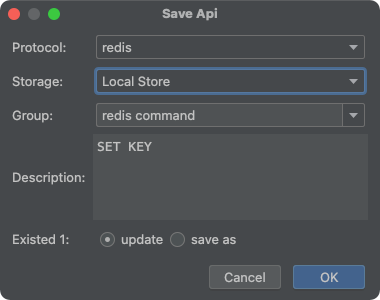
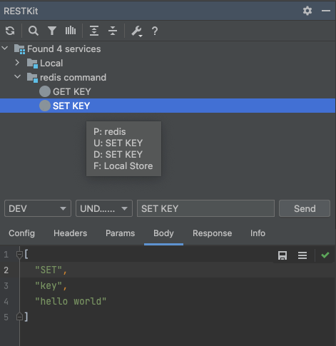

# RestfulBox-Redis

[简体中文](./README.zh_CN.md)

[RestfulBox-Redis](#) is a plugin that support redis for [RestfulBox](https://plugins.jetbrains.com/plugin/14723-restfulbox) plugin from version 2.0.3.

If this plugin helps, please **🌟Star**! If you have any good idea, please let me know.

## Install
- **Using IDE plugin system**

Recommended <kbd>Preferences(Settings)</kbd> > <kbd>Plugins</kbd> > <kbd>Browse repositories...</kbd> > <kbd>find "RestfulBox-Redis"</kbd> > <kbd>Install Plugin</kbd>

## Usage

### Save redis command

### Send redis command

UI introduction:

- Config: request config for redis, can use environment variable. Content:
  - address: redis server address. The default is `{{redisAddress}}`. Without this pair or env variable, will use address in the config.
- Headers: useless, just ignore.
- Params: useless, just ignore.
- Body: redis command using string array format.
- Response：response content.
- Info：request and response info.