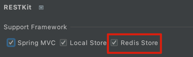
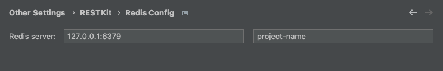
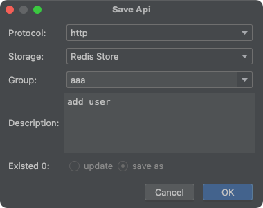

# RESTKit-Redis

本插件是[RestfulBox](https://plugins.jetbrains.com/plugin/14723-restfulbox) 的辅助插件，用于通过`RestfulBox`提供Redis的支持，功能比较简单。如果提升了你的开发效率，不妨一赞，同时也欢迎提供宝贵的建议。

## 安装
- **插件市场安装**

推荐 <kbd>Preferences(Settings)</kbd> > <kbd>Plugins</kbd> > <kbd>Browse repositories...</kbd> > <kbd>输入"RESTKit-Redis"</kbd> > <kbd>点击Install</kbd>

- **本地安装**

从仓库下载<kbd>distributions/RESTKit-Redis-x.x.x.zip</kbd>, 然后在本地Idea安装 <kbd>Preferences(Settings)</kbd> > <kbd>Plugins</kbd> > <kbd>Install Plugin from Disk...</kbd>

## 使用
安装完成后，在`RESTKit`插件设置中启用，填写相关配置。

配置redis服务器地址和项目名称，用于存储API。若发送redis命令时未指定redis地址，会使用此地址。

### 保存api到redis

### 保存redis命令

### 发送redis命令

UI说明：

- Config：请求配置，redis请求的一些配置，可使用环境变量。支持以下配置： 
  - address：redis地址，默认`{{redisAddress}}`，如没有配置环境变量，则请求时替换为配置中的redis服务器地址。
- Headers：在redis请求中没用到，请忽略
- Params：在redis请求中没用到，请忽略
- Body：redis命令内容，字符串数组格式
- Response：响应内容
- Info：一次请求响应的内容